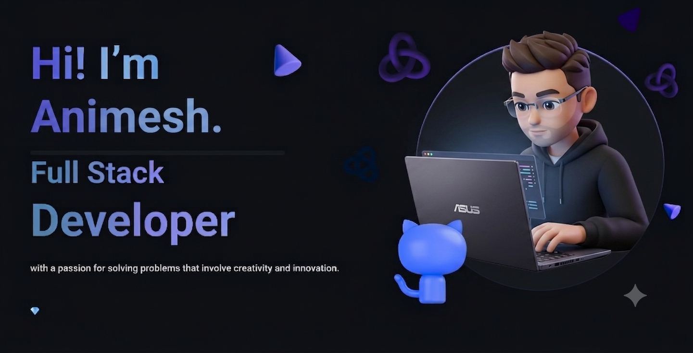

###

###
 

  
  
  

## 𝐇𝐞𝐥𝐥𝐨 𝐭𝐡𝐞𝐫𝐞, 𝐟𝐞𝐥𝐥𝐨𝐰 <𝚌𝚘𝚍𝚎𝚛 />! 

> [!CAUTION]
> - 🔖 Congratulations you found me

> [!NOTE]
> - 🚙 I’m currently working on web development technologies like `Spring Boot`, `Angular`, `React` etc.

> [!IMPORTANT]
> - 📚 I’m currently learning **Docker, Jenkins and Grafana**  also I’m currently working on building scalable full-stack applications with real-time capabilities using Socket.IO and modern web frameworks. 😅

> [!WARNING]  
> - 💪🏼 Future Goals: Learn more technologies, starting next with **SAP Commerce**. I am also heavily focused on integrating AI-driven features like semantic search, intelligent parsing, and LLM-based evaluation tools..

> [!TIP]  
> - 📗 If you're interested in collaborating or have any questions — I'd love to hear from you!

> 

>  
>   

> 

---

  &nbsp;&nbsp;
  &nbsp;&nbsp;
  &nbsp;&nbsp;
  &nbsp;&nbsp;
  &nbsp;&nbsp;
  &nbsp;&nbsp;
  

###

  
  
  
  

###

  
  

 

###
